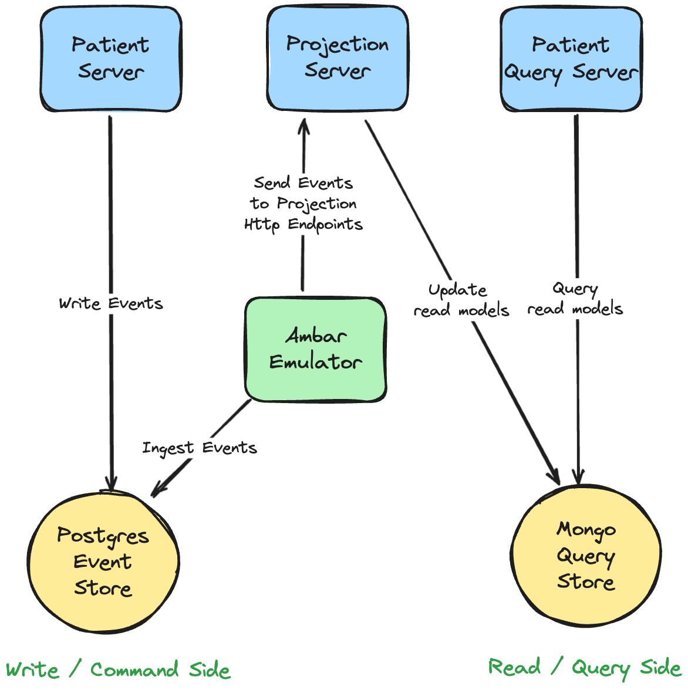

# Event-Sourced Clinic

A small but complete example of CQRS and Event-Sourcing in a largely simplified clinic domain.
The system is composed of a few http endpoints which expose the following use cases and queries:
- **Command** - Admit a patient to the clinic
- **Command** - Transfer a patient to a different ward
- **Command** - Discharge a patient
- **Query** - Fetch the complete patient roster

The system showcases [eventstore](https://github.com/aneshas/eventstore) library which uses postgres as an event store (in this case) 
along with its convenient abstractions (aggregate, eventstore, projection mechanism, etc...) and 
[Ambar](https://ambar.cloud/) data streaming [emulator](https://registry.hub.docker.com/r/ambarltd/emulator) as the event bus / projection engine 
which is used to project the events into a read model persisted in mongodb.

## How to run
1. Clone the repository
2. Run `docker-compose up` or `make up` (`make stop`) to start the services
3. Visit [swagger ui](http://localhost:8080/swagger/index.html) and explore the endpoints